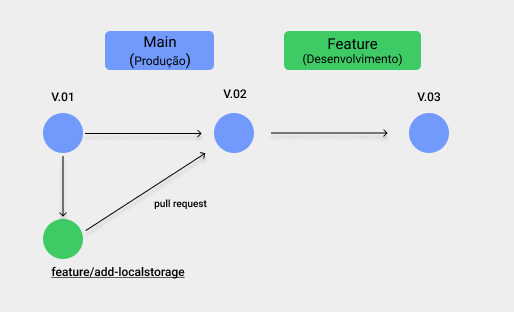

# Portfólio - Denise Rísia - Desafio 01 - Residência de Software - UNIRIO

## ⚙️ Tecnologias:

- HTML5
- Bootstrap 5
- CSS3
- Javascript

## ⚙️ Flow:

- O projeto deve seu deploy na V.01;
- Foi necessário adicionar uma nova funcionalidade, com isso foi criado uma feature/add-localstorage, e com isso agora está em sua V.02;
- Obs: V.01 significa 1º Release, ou seja, 1º Versão.

## ⚙️ Acesse: https://deniserisia.github.io/portfolio-drc/
